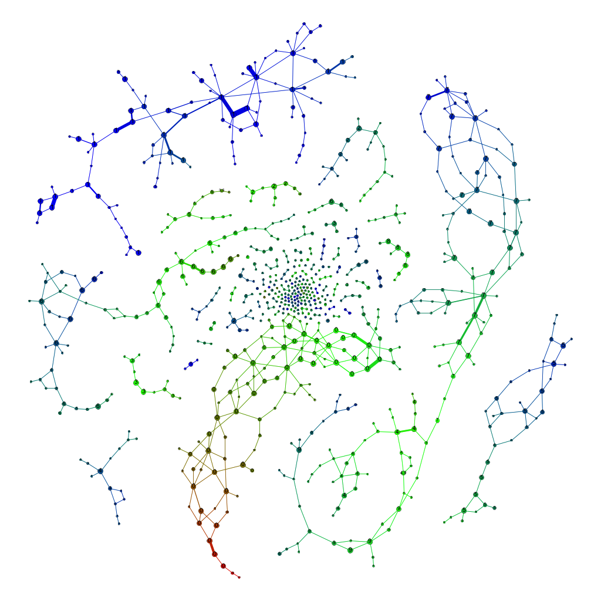
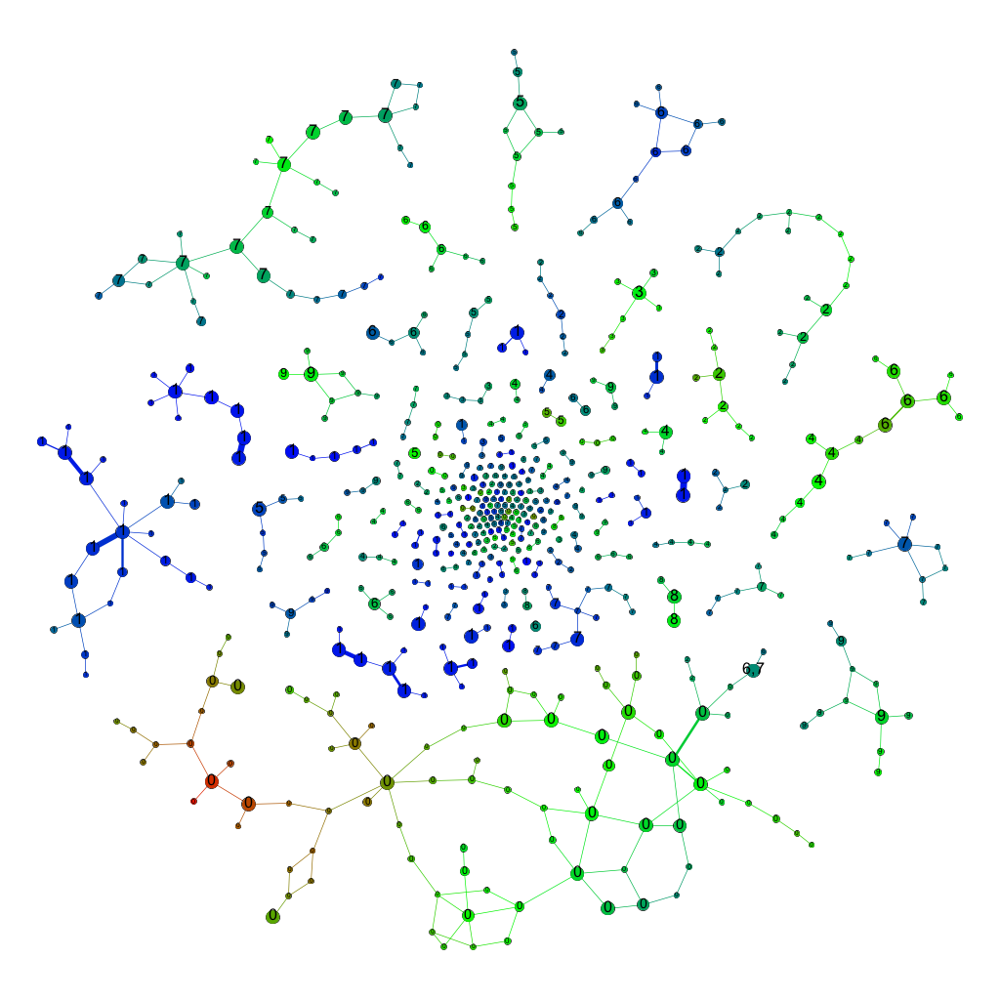

# SparkTDA

[](https://travis-ci.org/ognis1205/spark-tda)
[](https://codecov.io/gh/ognis1205/spark-tda?branch=master)
[](https://gitter.im/ognis1205/spark-tda?utm_source=badge&utm_medium=badge&utm_campaign=pr-badge&utm_content=badge)

The scalable topological data analysis package for [Apache Spark](http://spark.apache.org/). This project aims to
implement the following features:

- [x] [Scalable Mapper Implemented as Reeb Diagrams, i.e., Reeb Cosheaves](https://github.com/ognis1205/spark-tda/wiki/Mapper)
- [x] [Scalable Mapper Implementation](https://github.com/ognis1205/spark-tda/wiki/Mapper)
- [ ] Scalable Multiscale Mapper Implementation
- [ ] Scalable Tower Computation for Multiscale Mapper
- [ ] Scalable Persistent Homology Computation on Top of Apache Spark

If you would like to know how to use and/or learn more the implementation details of the above mentioned features, please follow the links.

# Status

**WIP** and **EXPERIMENTAL**. This package is still a proof-of-concept of scalable topological data analysis support for
Apache Spark, hence you cannot expect that this package is ready for production use.

# Examples

### Mapper

2-skeltons of Reeb Diagram of MNIST (40 intervals on the 1st primcipal component with 50% overlap) | 2-skeltons of Reeb Diagram of MNIST (20 intervals on the 1st primcipal component with 50% overlap)
:--------------------------------------------------------------------:|:-------------------------------------------------------------------:
60k images clustered in 784 dimensions without any projection loss | 60k images clustered in 784 dimensions witout any projection loss
           | 

# Requirements

This library requires Spark 2.0+

# Building and Running Unit Tests

To compile this project, run `sbt package` from the project home directory. This will also run the Scala unit tests.
To run the unit tests, run `sbt test` from the project home directory. This project uses the
[sbt-spark-package](https://github.com/databricks/sbt-spark-package) plugin, which provides the 'spPublish' and
'spPublishLocal' task. We recommend users to use this library with Apache Spark including the dependencies by
supplying a comma-delimited list of Maven coordinates with `--packages` and download the package from the locally
repository or official [Spark Packages](https://spark-packages.org/package/ognis1205/spark-tda) repository.

### The package can be published locally with:

```bash
$ sbt spPublishLocal
```

### The package can be published to [Spark Packages](https://spark-packages.org/package/ognis1205/spark-tda) with (requires authentication and authorization):

```bash
$ sbt spPublish
```

# Using with Spark Shell

This package can be added to Spark using the `--packages` command line option. For example, to include it when starting
the spark shell:

```bash
$ spark-shell --packages ognis1205:spark-tda:0.0.1-SNAPSHOT-spark2.2-s_2.11
```

# Future Works

### Mapper

- [ ] Write Wiki
- [ ] Implement Python APIs
- [ ] Publish to [Spark Packages](https://spark-packages.org/package/ognis1205/spark-tda)
- [ ] Benchmark
- [ ] Consider using [GraphFrames](https://github.com/graphframes/graphframes) instead of plain GraphX
- [ ] Implement some useful filter functions, e.g., Gaussian Density, Graph Laplacian, etc as transformers

# Related Softwares $ Projects

1. [Python Mapper](http://danifold.net/mapper/index.html)
2. [TDAMapper (R)](https://github.com/paultpearson/TDAmapper/)
3. [Spark Mapper (Spark)](https://github.com/log0ymxm/spark-mapper)
4. [KeplerMapper (Python with GUI)](https://github.com/MLWave/kepler-mapper)

# References

### Mapper

1. [G. Singh, F. Memoli, G. Carlsson (2007). Topological Methods for the Analysis of High Dimensional Data Sets and 3D Object Recognition, Point Based Graphics 2007, Prague, September 2007.](https://research.math.osu.edu/tgda/mapperPBG.pdf)
2. [J. Curry (2013). Sheaves, Cosheaves and Applications, arXiv 2013](https://arxiv.org/abs/1303.3255)
3. [T. K. Dey, F. Memoli, Y. Wang (2015), Mutiscale Mapper: A Framework for Topological Summarization of Data and Maps, arXiv 2015](https://arxiv.org/abs/1504.03763)
4. [E. Munch, B. Wang (2015). Convergence between Categorical Representations of Reeb Space and Mapper, arXiv 2015](https://arxiv.org/abs/1512.04108)
5. [E. Munch, B. Wang (2015). Reeb Space Approximation with Guarantees, The 25th Fall Workshop on Computational Geometry 2015.](https://www.cse.buffalo.edu/fwcg2015/assets/pdf/FWCG_2015_paper_2.pdf)
6. [H. E. Kim (2015). Evaluating Ayasdi's Topological Data Analysis for Big Data, Master Thesis, Goethe University Frankfurt 2015.](http://www.bigdata.uni-frankfurt.de/wp-content/uploads/2015/10/Evaluating-Ayasdi’s-Topological-Data-Analysis-For-Big-Data_HKim2015.pdf)

### KNN/ANN/SNN

1. [L. Ting, et al (2004). An investigation of practical approximate nearest neighbor algorithms, Advances in neural information processing systems. 2004.](http://www.cs.cmu.edu/~agray/approxnn.pdf)
2. [L. Ting, C. Rosenberg, H. Rowley (2007). Clustering billions of images with large scale nearest neighbor search. Applications of Computer Vision, 2007. WACV'07. IEEE Workshop on. IEEE, 2007.](https://ieeexplore.ieee.org/document/4118757/)
3. [D. Ravichandran, P. Pantel, E. Hovy (2005). Randomized algorithms and NLP: using locality sensitive hash function for high speed noun clustering, ACL '05 Proceedings of the 43rd Annual Meeting on Association for Computational Linguistics pp 622-629 ](https://dl.acm.org/citation.cfm?id=1219917)
4. [M. Steinbach, L. Ertoez, V. Kumar (2004). The Challenges of Clustering High Dimensional Data, New Directions in Statistical Physics, pp 273-309](https://www-users.cs.umn.edu/~kumar001/papers/high_dim_clustering_19.pdf)
5. [L. Ertoez, M. Steinbach, Vipin Kumar (2003). Finding clusters of different sizes, shapes, and densities in noisy, high dimensional data, Proceedings of the Third SIAM International Conference on Data Mining, 2003.](https://www-users.cs.umn.edu/~kumar001/papers/SIAM_snn.pdf)
6. [M. E. Houle, H. P. Kriegel, P. Kroeger, E. S. A. Zimek (2010). Can Shared-Neighbor Distances Defeat the Curse of Dimensionality?, Proceedings of the 22nd International Conference on Scientific and Statistical Database Management, 2010.](https://imada.sdu.dk/~zimek/publications/SSDBM2010/SNN-SSDBM2010-preprint.pdf)

### LSH

1. [M. S. Charikar (2002). Similarity Estimation Techniques from Rounding Algorithms, 34th STOC, 2002.](http://www.cs.princeton.edu/courses/archive/spr04/cos598B/bib/CharikarEstim.pdf)